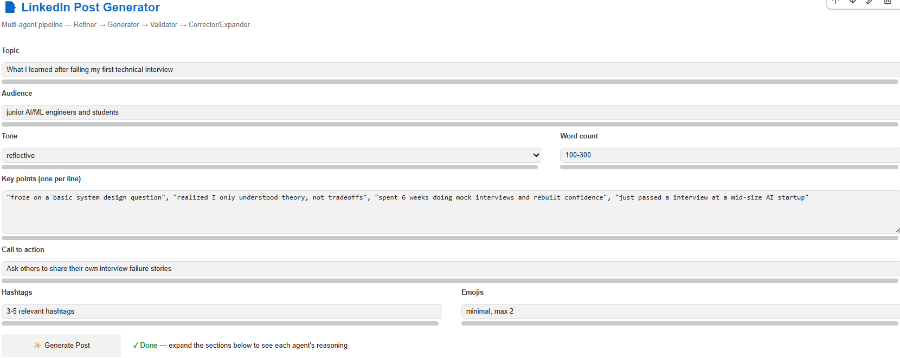
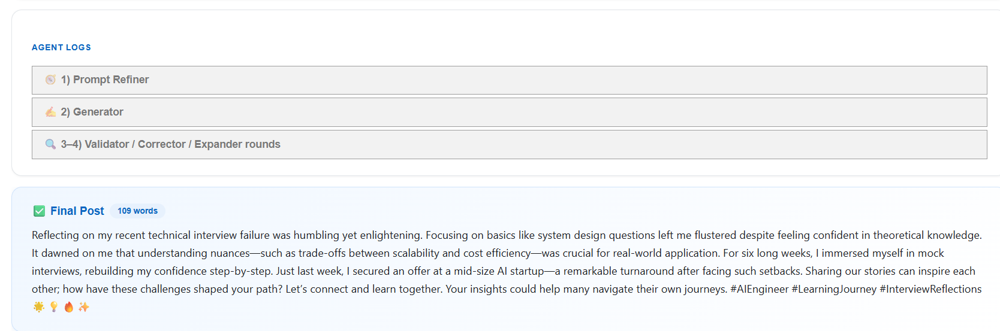

# LinkedIn Agentic Generator

A multi-agent LinkedIn post generator built on a single small LLM (≤3B parameters, e.g. **Qwen2.5-3B-Instruct**). Instead of one prompt → one output, the system simulates an agentic workflow using plain Python — no external agent framework required.


## Demo

**Input form:**



**Generated output:**




## How it works

The same model plays four different roles, each with its own system prompt, orchestrated by a simple Python state machine:

1. **Prompt Refiner** — takes raw user input (topic, audience, tone, key points, CTA, constraints) and rewrites it into a clean, well-structured generation prompt following prompt-engineering best practices.
2. **Generator** — writes the LinkedIn post draft from the refined prompt.
3. **Validator** — checks the draft against a rubric (hook quality, tone, length, CTA, cliché-free, emoji/hashtag policy, factual consistency) and returns a structured JSON verdict.
4. **Corrector / Expander** — if validation fails, fixes only the flagged issues (Corrector) or grows a too-short draft with genuine content (Expander), then loops back to the Validator (max 3 rounds).

Deterministic, code-based checks (word count, emoji count, meta-commentary detection) back up the LLM validator, since small models are unreliable at precise counting and qualitative judgment.

## Architecture

```
User Input
    │
    ▼
[1] Prompt Refiner Agent
    │
    ▼
[2] Generator Agent
    │
    ▼
[3] Validator Agent ──PASS──► Final Post
    │
   FAIL
    │
    ▼
[4] Corrector Agent (issue fixes) or Expander Agent (length issues)
    │
    └──► back to [3] (max 3 iterations)
```

## Requirements

- Google Colab (or any environment with GPU access)
- Python 3.10+
- `transformers`, `accelerate`, `bitsandbytes`, `ipywidgets`

## Usage

1. Open `linkedin_agentic_generator.ipynb` in Google Colab.
2. Set runtime to **GPU** (Runtime → Change runtime type → T4/L4 GPU).
3. Run all cells top to bottom to load the model (`Qwen/Qwen2.5-3B-Instruct`).
4. Use the interactive UI at the end of the notebook: fill in topic, audience, tone, key points, CTA, word count, hashtag/emoji policy, then click **Generate Post**.
5. Expand the agent log panels to inspect each step's reasoning (refined prompt, drafts, validator verdicts).

Alternatively, call the pipeline directly in code:

```python
user_input = {
    "topic": "Launching my new open-source ML library",
    "audience": "AI engineers and recruiters",
    "tone": "confident but humble",
    "key_points": [
        "3 months of work",
        "cuts inference latency by 40%",
        "MIT licensed"
    ],
    "cta": "Ask them to try it and give feedback",
    "word_count": "120-180",
    "hashtags": "3-5 relevant hashtags",
    "emojis": "minimal, max 2"
}

result = generate_linkedin_post(user_input, verbose=True)
print(result["final_post"])
```

## Notes

- The model is small (≤3B), so hard constraints (word count, emoji count) are enforced with code rather than relying solely on the LLM validator.
- `min_new_tokens` and a dedicated Expander agent prevent the model from stopping short of the requested word range.
- Meta-commentary / placeholder text (e.g. "replace this link") is stripped automatically as a safety net.