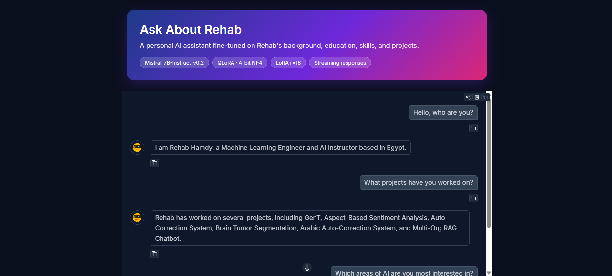

# Personal AI Assistant — Mistral-7B QLoRA Fine-Tuning

Fine-tune **Mistral-7B-Instruct-v0.2** with **QLoRA** (4-bit NF4 quantization + LoRA adapters) to build a personal AI assistant that answers questions about Rehab's background, education, skills, and projects. The whole pipeline runs on a single free-tier **Tesla T4 (~15.6 GB)** GPU.



---

## Highlights

- **Base model:** `mistralai/Mistral-7B-Instruct-v0.2` (7.28B parameters)
- **Method:** QLoRA — 4-bit NF4 quantization with double quantization, LoRA on all attention and MLP projections
- **Trainable parameters:** 41.9M of 7.28B (**0.58%**)
- **Dataset:** 167 instruction/response pairs across 20 categories
- **Training time:** ~27 minutes on a single T4
- **Output:** a lightweight LoRA adapter, ready to attach to the 4-bit base model or merge into it

---

## Repository Contents

| File | Description |
|------|-------------|
| `personal-mistral-7b-qlora-finetuning.ipynb` | End-to-end notebook: setup, data prep, training, evaluation, adapter export, inference, chatbot |
| `personal_finetuning_dataset.csv` | Training data (`id`, `category`, `instruction`, `response`) |
| `personal-qlora-adapter/` | Output directory (checkpoints, metrics, `final_adapter/`) |

---

## Dataset

The dataset is a CSV with four columns: `id`, `category`, `instruction`, `response`. It contains **167 examples** with no missing values, split **90 / 10** into **150 train / 17 validation** examples (seed 42).

| Category | Examples |
|----------|---------:|
| Projects | 41 |
| General Questions About Me | 32 |
| Personal Background | 10 |
| Education | 8 |
| LLMs | 8 |
| Internships | 7 |
| Courses, Programming, Technical Skills, Achievements | 6 each |
| Tools & Frameworks, Machine Learning, Deep Learning, NLP | 5 each |
| Computer Vision | 4 |
| Work Experience, Certifications, Generative AI | 3 each |
| Career Background, Interests | 2 each |

### Prompt format

Mistral's chat template has no `system` role, so the system instruction is folded into the first user turn and the model's own chat template (`apply_chat_template`) is used for formatting:

```
[INST] You are a personal AI assistant that answers questions about Rehab,
based only on known facts about her background, education, skills, and projects.

<question> [/INST] <answer></s>
```

---

## Configuration

| Group | Setting | Value |
|-------|---------|-------|
| Quantization | Type / double quant / compute dtype | NF4 / on / bfloat16 (fp16 fallback) |
| LoRA | Rank `r` / alpha / dropout | 16 / 32 / 0.05 |
| LoRA | Target modules | `q_proj`, `k_proj`, `v_proj`, `o_proj`, `gate_proj`, `up_proj`, `down_proj` |
| Training | Epochs | 3 |
| Training | Learning rate | 1e-4 |
| Training | Batch size (per device × grad. accumulation) | 1 × 16 = 16 effective |
| Training | Warmup / weight decay | 5 steps / 0.01 |
| Training | Optimizer | `paged_adamw_8bit` |
| Training | Max sequence length | 512 |
| Training | Gradient checkpointing | Enabled |
| Training | Early stopping | Patience 2 (on validation loss), best model loaded at end |
| Training | Loss | `nll` |
| Training | Seed | 42 |

---

## Results

Training ran for 30 steps (3 epochs) in about 27 minutes on a Tesla T4.

| Metric | Value |
|--------|------:|
| Train loss | 1.462 |
| Validation loss | 1.114 |
| Validation perplexity | 3.05 |
| Validation mean token accuracy | 78.4% |

The notebook also compares the base model against the fine-tuned model on two sets of test questions (5 and 20 questions) and saves the answers to `base_vs_finetuned_comparison.json`.

**Example (fine-tuned model):**

> **Q:** Which areas of AI is Rehab most interested in?
> **A:** Rehab is most interested in Generative AI, LLM Fine-Tuning, and Multi-Org RAG Chatbots.

---

## Getting Started

### Requirements

- Python 3.10+
- A CUDA GPU with ~15 GB VRAM (developed on Kaggle with a Tesla T4)
- A Hugging Face account with access to the Mistral model (set `HF_TOKEN` to avoid rate limits)

### Install

```bash
pip install -U "transformers>=4.44.0" "datasets>=2.20.0" "accelerate>=0.33.0" \
    "peft>=0.12.0" "bitsandbytes>=0.43.1" "trl>=0.9.6" \
    sentencepiece evaluate scikit-learn pandas
```

### Train

1. Place `personal_finetuning_dataset.csv` somewhere accessible and update `dataset_path` in the `Config` class (the notebook currently points to a Kaggle input path).
2. Open the notebook and run the cells in order.
3. The adapter is saved to `./personal-qlora-adapter/final_adapter/`.

If you hit out-of-memory errors, reduce `max_seq_length` to 256.

### Inference

```python
import torch
from transformers import AutoTokenizer, AutoModelForCausalLM, BitsAndBytesConfig
from peft import PeftModel

BASE = "mistralai/Mistral-7B-Instruct-v0.2"
ADAPTER = "./personal-qlora-adapter/final_adapter"

bnb = BitsAndBytesConfig(
    load_in_4bit=True,
    bnb_4bit_quant_type="nf4",
    bnb_4bit_use_double_quant=True,
    bnb_4bit_compute_dtype=torch.bfloat16,
)

base = AutoModelForCausalLM.from_pretrained(BASE, quantization_config=bnb, device_map="auto")
model = PeftModel.from_pretrained(base, ADAPTER).eval()
tokenizer = AutoTokenizer.from_pretrained(ADAPTER)

SYSTEM = ("You are a personal AI assistant that answers questions about Rehab, "
          "based only on known facts about her background, education, skills, and projects.")

def answer_about_me(question, max_new_tokens=150):
    messages = [{"role": "user", "content": f"{SYSTEM}\n\n{question}"}]
    prompt = tokenizer.apply_chat_template(messages, tokenize=False, add_generation_prompt=True)
    inputs = tokenizer(prompt, return_tensors="pt").to(model.device)
    with torch.no_grad():
        out = model.generate(**inputs, max_new_tokens=max_new_tokens,
                             do_sample=True, temperature=0.4, top_p=0.9,
                             pad_token_id=tokenizer.eos_token_id)
    return tokenizer.decode(out[0][inputs["input_ids"].shape[1]:], skip_special_tokens=True).strip()

print(answer_about_me("What projects has Rehab worked on?"))
```

The notebook also includes an interactive `chat_loop()` for asking questions in a live session.

### Optional: merge the adapter

Set `RUN_MERGE = True` in the notebook to reload the base model in bf16/fp16 and merge the adapter into a standalone model saved to `personal-qlora-adapter/merged_model/`.

---

## Notebook Structure

1. Environment setup
2. Imports
3. Configuration
4. Load the CSV dataset
5. Dataset preprocessing (chat-template formatting)
6. Train/validation split
7. Load the base model (4-bit)
8. 4-bit quantization details (`prepare_model_for_kbit_training`)
9. LoRA configuration
10. Training (with a 3-step smoke test before the full run)
11. Evaluation and base-vs-fine-tuned comparison
12. Save the LoRA adapter
13. Optional adapter merge
14. Inference function
15. Interactive chatbot

---

## Limitations

- **Very small dataset (167 examples).** The model can memorize facts but may also hallucinate or blend details, especially for dates and specifics not clearly covered in the data. Always verify important answers against the source data.
- **Single-domain scope.** The assistant is trained only to answer questions about one person and is not a general-purpose model.
- **Small validation set (17 examples).** Reported validation metrics are indicative, not statistically robust.
- **No formal factuality benchmark.** Evaluation is loss/perplexity plus qualitative base-vs-fine-tuned comparison.

---

## Acknowledgments

- [Mistral AI](https://mistral.ai/) for Mistral-7B-Instruct-v0.2
- Hugging Face `transformers`, `peft`, `trl`, and `datasets`
- [`bitsandbytes`](https://github.com/bitsandbytes-foundation/bitsandbytes) for 4-bit quantization
- QLoRA: Dettmers et al., *QLoRA: Efficient Finetuning of Quantized LLMs* (2023)

## License

Add a license of your choice. Note that the base model is subject to its own license terms on Hugging Face.
